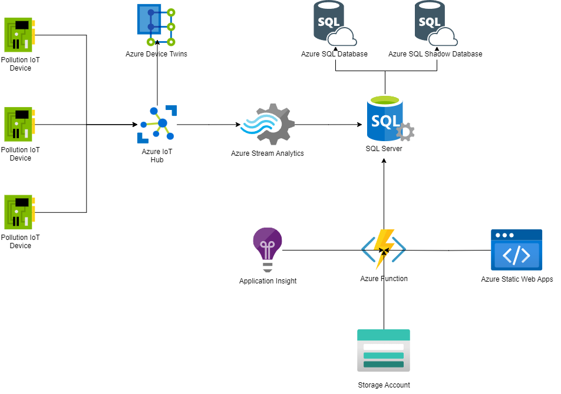

  

# GATES

## Descrizione del Progetto

### Abstract
Il progetto GATES mira a sviluppare un sistema completo di monitoraggio ambientale dedicato alle concerie. Attraverso l'impiego di dispositivi IoT, il sistema raccoglie in tempo reale dati critici sugli scarti generati, come l'acqua contaminata e le emissioni gassose. L'obiettivo è creare un sistema integrato che analizzi e archivi accuratamente tali dati, permettendo agli utenti di accedere a informazioni aggregate attraverso un'interfaccia utente intuitiva. Questo approccio fornisce strumenti avanzati per decisioni informate sulla gestione ambientale, contribuendo a rendere il settore conciario più sostenibile.

## Benefici del Sistema Proposto

1. **Monitoraggio in Tempo Reale**: Il sistema consente il monitoraggio in tempo reale degli scarti ambientali, consentendo agli operatori di reagire immediatamente a situazioni critiche.
2. **Riduzione degli Sprechi**: Analizzando i dati raccolti, è possibile identificare aree di miglioramento per ridurre gli sprechi e adottare pratiche più sostenibili.
3. **Decisioni Informate**: L'interfaccia utente fornisce dati aggregati e report dettagliati, supportando decisioni informate sulla gestione ambientale.
4. **Conformità Normativa**: Il sistema aiuta a rispettare normative ambientali stringenti attraverso la raccolta e la presentazione accurata dei dati di monitoraggio.

## Servizi Utilizzati

1. **Azure IoT Hub:** Gestisce la connessione e la comunicazione bidirezionale con i dispositivi IoT, garantendo la gestione efficiente dei dispositivi distribuiti in una conceria.
2. **Azure Digital Twin:** Utilizzato per gestire ogni dispositivo IoT connesso.
3. **Azure Stream Analytics:** Analizza in tempo reale i dati dai dispositivi IoT, facilitando l'elaborazione e l'archiviazione immediata dei dati relativi all'inquinamento.
4. **Azure SQL Database:** Database relazionale scelto per la sua struttura tabellare e capacità di gestire dati strutturati in modo efficiente.
5. **Azure Functions:** Utilizzate per consentire all'interfaccia utente di accedere al database e recuperare i dati relativi all'inquinamento.
6. **Azure App Service:** Creazione di un'applicazione web con un'interfaccia utente intuitiva per gli utenti finali.

## Architettura del Progetto

Le concerie associano i dispositivi IoT all'hub IoT di Azure, consentendo una gestione centralizzata dei dispositivi. I dati inviati dai dispositivi vengono elaborati in tempo reale attraverso Azure Stream Analytics e archiviati in un database SQL di Azure. Le Azure Functions permettono all'interfaccia utente di accedere ai dati. Azure App Service supporta la creazione di un'interfaccia utente intuitiva per il monitoraggio dei dati ambientali.

